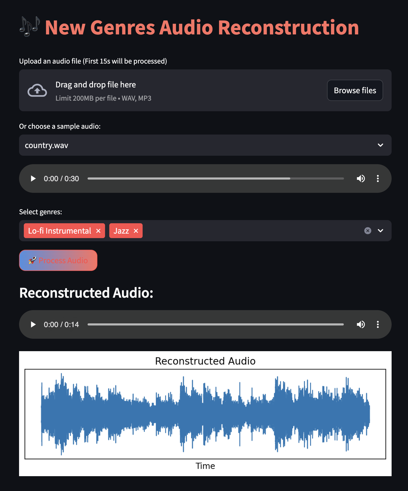

# 🎶 VAE-MusicGen

## Overview
This project utilizes Conditional Variational Autoencoders (VAEs) to generate instrumental music. The streamlit application allows users to upload an audio file or choose a sample audio, select the predefined genres, and the system will create unique compositions

## Getting Started


### 1. Clone the Repository
```bash
git clone https://github.com/toan-ly/VAE-MusicGen.git
cd VAE-MusicGen
```

### 2. Install Dependencies
```bash
pip install -r requirements.txt
```

### 3. Crawl data
To collect music data from the web, run ```crawl_data.ipynb``` in ```notebooks/```

### 4. Train models
Training script is in `notebook/train_CVAE.ipynb`

### 5. Run streamlit app
```bash
streamlit run app.py
```

## Demo

